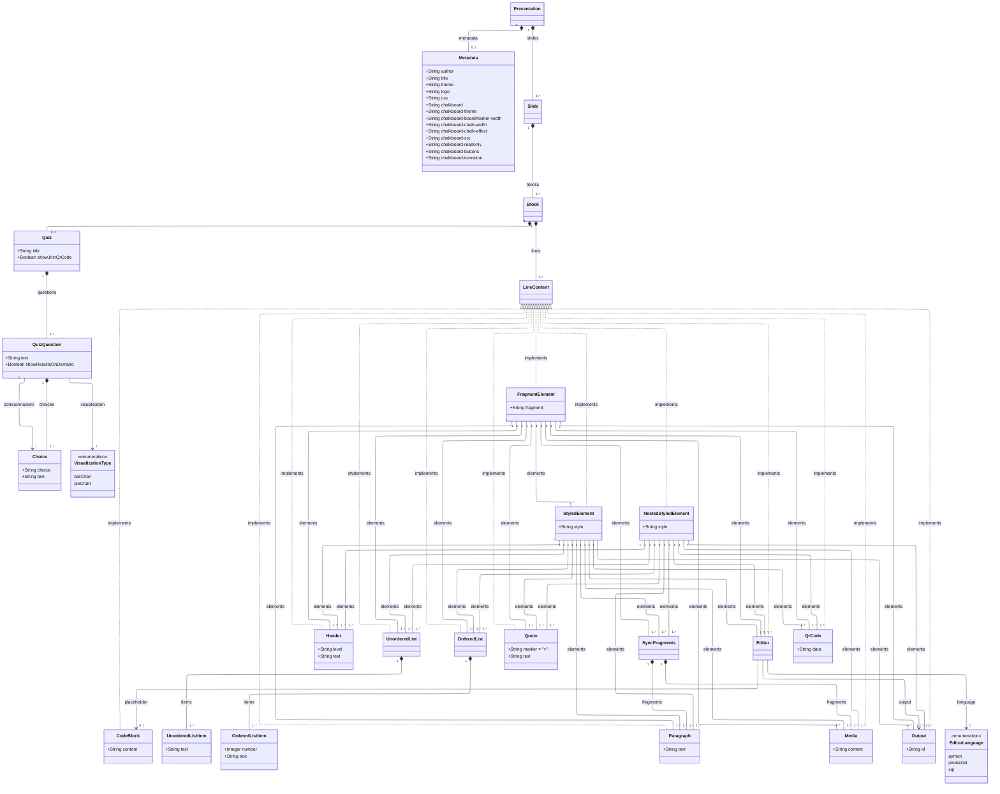

# Rapport V1

## **Membres de l’équipe :**

- Roxane BACON
- Baptiste LACROIX
- Baptiste ROYER
- Théo VIDAL

## **Lien vers le code de votre DSL :**

https://github.com/RoxaneBacon/sse-dsl-SlideDeckML

## **Description du langage proposé**

### **Modèle du domaine représenté sous forme de diagramme de classes**



**Syntaxe des terminaux :**

- **Header** : `#` (h1), `##` (h2), `###` (h3)
- **UnorderedList** : `-`, `*` ou `+` suivi du texte
- **OrderedList** : `1.`, `2.`, `3.` etc. suivi du texte
- **Quote** : `>` suivi du texte
- **CodeBlock** : délimité par ` ``` ` avec support d'options (`[highlight: ...]`, `[lines: ...]`, `[start: ...]`)
- **Media** : `` pour images/vidéos
- **StyledElement** : `:::` délimiteurs avec attributs CSS `{style: value; ...}`
- **FragmentElement** : `:::` avec attributs `{animate: "effect" index: N}`
- **Slide separator** : `===`
- **SyncFragments** : `:::[sync-fragments]` avec éléments séparés par `[---]`
- **Quiz** : `:::quiz` avec questions et choix
- **Editor** : `,,,ide` avec langage (python/javascript/sql)
- **QrCode** : `![QR]data`

### **Syntaxe concrète représentée dans une forme de type BNF**

```ebnf
<Presentation> ::= [<Metadata>] [<SlideSection>]

<SlideSection> ::= [SLIDE_SEPARATOR] <Slide> (SLIDE_SEPARATOR <Slide>)* [SLIDE_SEPARATOR]

<Metadata> ::= "{" "author" ":" <STRING> "title" ":" <STRING>
               [ "theme" ":" <STRING> ]
               [ "logo" ":" <STRING> ]
               [ "css" ":" <STRING> ]
               [ "transition" ":" <STRING> ]
               [ "chalkboard" ":" <STRING> ]
               [ "chalkboard-theme" ":" <STRING> ]
               [ "chalkboard-boardmarker-width" ":" <STRING> ]
               [ "chalkboard-chalk-width" ":" <STRING> ]
               [ "chalkboard-chalk-effect" ":" <STRING> ]
               [ "chalkboard-src" ":" <STRING> ]
               [ "chalkboard-readonly" ":" <STRING> ]
               [ "chalkboard-buttons" ":" <STRING> ]
               [ "chalkboard-transition" ":" <STRING> ]
               "}"

<Slide> ::= [<TRANSITION_ATTR>] <Block>+

<Block> ::= <Quiz> | <LineContent>+

<LineContent> ::= <FragmentElement> | <StyledElement> | <Header> | <UnorderedList> | <OrderedList>
                | <Quote> | <Media> | <Paragraph> | <CodeBlock> | <SyncFragments>

<CodeBlock> ::= CODE_BLOCK

<SyncFragments> ::= [SYNC_DELIMITER_KEEP | SYNC_DELIMITER] <FragmentItem> (FRAGMENT_SEPARATOR <FragmentItem>)* [SYNC_DELIMITER_KEEP | SYNC_DELIMITER]

<FragmentItem> ::= <PARAGRAPH_TEXT> | <MEDIA_LINE>

<FragmentElement> ::= STYLE_DELIMITER <FRAGMENT_ATTRS> <FragmentElement>+

<StyledElement> ::= STYLE_DELIMITER <STYLE_ATTRS> <StyledElement>+

<UnorderedList> ::= <UnorderedListItem>+

<OrderedList> ::= <OrderedListItem>+

<Header> ::= HEADER_LEVEL <PARAGRAPH_TEXT>

<UnorderedListItem> ::= LIST_MARKER <PARAGRAPH_TEXT>

<OrderedListItem> ::= <INT> "." <PARAGRAPH_TEXT>

<Paragraph> ::= <PARAGRAPH_TEXT>

<Quote> ::= ">" <PARAGRAPH_TEXT>

<Media> ::= <MEDIA_LINE>

<Editor> ::= IDE_START <EditorLanguage> [ <CODE_BLOCK> ] [ <Output> ] IDE_DELIMITER

<Output> ::= 'output' ':' <STRING>

<EditorLanguage> ::= 'python' | 'sql' | 'javascript'

<QrCode> ::= '![QR]'<STRING>

<Quiz> ::= <QUIZ_START> <STRING> [ 'showJoinQrCode' ':' <BOOLEAN> ] <QuizQuestion>+ <STYLE_DELIMITER>

<QuizQuestion> ::= 'question' ':' <STRING> <Choice>+ [ 'correct' ':' <STRING> ]+ [ 'showResultsOnDemand' ':' <BOOLEAN> ] [ 'visualization' ':' <VisualizationType> ]

<Choice> ::= 'choice' <STRING> ':' <STRING>

<VisualizationType> ::= 'barChart' | 'pieChart'

<QUIZ_START> ::= /:::quiz/

<IDE_START> ::= /,,,ide/

<IDE_DELIMITER> ::= /,,,/

<CODE_BLOCK> ::= /```[a-zA-Z0-9_\\-]*(?:\\s*\\[(?:(?:highlight:\\s*(?:block|function|class|line-by-line|all|none))|(?:lines:\\s*["'][^"']+["'])|(?:start:\\s*\\d+)|\\s)+\\])?[\\r\\n]([\\s\\S]*?)```/

<SYNC_DELIMITER_KEEP> ::= /:::\\[sync-fragments\\s+keep\\]/

<SYNC_DELIMITER> ::= /:::\\[sync-fragments\\]/

<FRAGMENT_SEPARATOR> ::= /\\[\\-\\-\\-\\]/

<MEDIA_LINE> ::= /!\\[[^\\]]+\\]\\([^\\)]+\\)/

<TRANSITION_ATTR> ::= /\\{transition:\\s*["'][^"']+["']\\}/

<FRAGMENT_ATTRS> ::= /\\{animate:\\s*["'][^"']+["'](?:\\s+index:\\s*\\d+)?\\}/

<STYLE_ATTRS> ::= /\\{[^\\}\\r\\n]+\\}/

<STYLE_DELIMITER> ::= /:::/

<SLIDE_SEPARATOR> ::= /===[\\t ]*\\r?\\n/

<HEADER_LEVEL> ::= /###|##|#/

<LIST_MARKER> ::= /[\\-\\*\\+]/

<PARAGRAPH_TEXT> ::= /(?!(###|##|#)[ \\t]+)(?![\\-\\*\\+][ \\t]+)(?![0-9]+\\.[ \\t]+)(?!>)(?!\\!\\[)(?!:::)(?!```)(?!===)(?!---)(?!\\[\\-\\-\\-\\])(?![\\s]*\\{)(?![\\s]*\\})(?![\\s]*author)(?![\\s]*title)(?![\\s]*css)(?![\\s]*logo)(?![\\s]*theme)(?![\\s]*transition)(?![\\s]*chalkboard)(?![\\s]*:)(?!")(?\\.)[^\\r\\n]+/

<STRING> ::= /"(?:\\\\.|[^"\\\\])*"/

<ID> ::= /[a-zA-Z_][a-zA-Z0-9_\\-]*/

<INT> ::= /[0-9]+/

<NEWLINE> ::= /\\r?\\n/

<WS> ::= /[ \\t]+/

<ML_COMMENT> ::= /\\/\\*[\\s\\S]*?\\*\\//

<SL_COMMENT> ::= /\\/\\/[^\\n\\r]*/

```

## **Description de votre langage et de la manière dont il a été implémenté**

## 1.1. Structure du langage

Le langage est organisé autour de trois composants principaux définis dans la grammaire :

### **1 - Métadonnées (Metadata)**

Section optionnelle entre accolades définissant les propriétés globales de la présentation :

- Informations de base : `author`, `title`, `theme`, `logo`, `css`
- Configuration des transitions : `transition`
- Configuration du plugin chalkboard : `chalkboard`, `chalkboard-theme`, `chalkboard-readonly`, etc. [slide-deck.langium#L10-L17](https://github.com/RoxaneBacon/sse-dsl-SlideDeckML/blob/main/src/language/slide-deck.langium#L10-L17)

### **2 - Slides**

Séparées par `===`, chaque slide contient :

- Attributs optionnels de transition : `{transition: "slide"}`
- Blocs de contenu

### **3 - Blocs de contenu (LineContent)**

Ensemble d'éléments de présentation :

- Markdown standard : Headers (`#`, `##`, `###`), listes ordonnées (`1.`,`2.`, `3.`, etc…), listes non-ordonnées (, , `+`), citations (`>`), paragraphes
- Blocs de code (`````): Avec coloration syntaxique et options avancées (`[highlight: line-by-line]`, `[lines: "1-5,10"]`, `[start: 5]`)
- Fragments animés : Système `{animate: "fade-in"}` avec indices optionnels (`index: 2`) pour contrôler l'ordre d'apparition
- Synchronisation de fragments : `:::[sync-fragments]` pour animer plusieurs éléments simultanément
- Médias : Images et vidéos (incluant YouTube)
- Styling dynamique : Délimiteurs `:::` avec attributs CSS inline (`{color: red; font-size: 2em}`)
- Support Chalkboard : Intégration native du plugin reveal.js pour dessiner sur les slides
- IDE intégré : Éditeur Monaco avec exécution Python (Pyodide), JavaScript et SQL

## 1.2. Outils et CLI:

Le CLI propose deux commandes :

1. **`compile`** : Génère le HTML à partir d'un fichier `.sdml`
    
    ```bash
    node out/cli/main.js compile ./path/to/presentation.sdml -o output.html
    
    ```
    
2. **`dev`** : Lance un serveur de développement avec live-reload et preview en temps réel
    
    ```bash
    npm run dev ./path/to/presentation.sdml
    
    ```
    

### **Scripts de build automatisés**

Deux scripts shell équivalents facilitent le workflow :

- **`build-and-compile.ps1` (PowerShell)** / **`build-and-compile.sh` (Bash)**
    - Build automatique : Exécute `langium:generate` pour générer le parser et `npm run build` pour compiler TypeScript
    - Compilation par lot : Supporte la compilation d'un fichier unique ou d'un répertoire entier de fichiers `.sdml`
    - Gestion flexible des sorties : Spécification d'un répertoire de sortie personnalisé ou génération dans le même répertoire que la source

**Éditeur web avec Monaco Editor**

Pour améliorer l'adoption de SlideDeckML, nous avons développé un éditeur web interactif basé sur Monaco Editor (le même moteur d'édition que VS Code). Le projet nous a montré qu'un DSL gagne en accessibilité lorsqu'il est accompagné d'outils qui facilitent son utilisation au quotidien. C'est particulièrement vrai pour un langage de création de présentations : pouvoir visualiser instantanément le résultat de son code améliore l’experience et réduit l’effort d'apprentissage. Cet éditeur constitue donc un élément clé pour favoriser l'acceptation du langage par notre public cible d'enseignants et d'étudiants.

**Architecture de l'éditeur :**

L'interface est divisée en deux panneaux :


- **Panneau gauche** : Éditeur Monaco avec le code source `.sdml`
    - Coloration syntaxique adaptée au langage SlideDeckML
    - Autocomplétion et suggestions contextuelles
    - Détection d'erreurs en temps réel
    - Numérotation des lignes et raccourcis clavier familiers

- **Panneau droit** : Preview live de la présentation compilée
    - Rendu HTML reveal.js en temps réel
    - Navigation interactive dans les slides
    - Actualisation automatique lors des modifications

**Fonctionnalités principales :**

1. **Synchronisation automatique des slides**
    
    Lorsque l'utilisateur modifie une slide dans l'éditeur (détection via le séparateur `===`), la preview se déplace automatiquement vers la slide correspondante. Cette synchronisation bidirectionnelle permet de :
    
    - Visualiser immédiatement l'impact des modifications
    - Naviguer dans la présentation et voir le code correspondant
    - Gagner du temps en évitant les compilations manuelles
2. **Hot-reload intelligent**
    
    Les modifications sont compilées et affichées en temps réel sans recharger complètement la page. Le système détecte :
    
    - Les changements de contenu (texte, code, médias)
    - Les modifications de métadonnées (thème, transitions)
    - Les ajouts/suppressions de slides
3. **Expérience de développement fluide**
    
    L'intégration de Monaco Editor offre les mêmes fonctionnalités qu'un IDE moderne :
    
    - Recherche et remplacement avec regex
    - Multi-curseurs et édition en bloc
    - Indentation automatique
    - Historique d'annulation/rétablissement
    - Raccourcis VS Code natifs (Ctrl+S pour sauvegarder, Ctrl+F pour rechercher, etc.)

L'outil est accessible via `npm run dev`, qui lance un serveur local avec l'éditeur Monaco pré-configuré pour le langage SlideDeckML.

### 1.3. Choix techniques justifiés

**Technologies choisies**

Pour le développement de SlideDeckML, nous avons fait des choix technologiques basés principalement sur l'interopérabilité et la simplicité d'intégration.

**DSL interne vs externe :**

Une décision importante a été le type de DSL à développer. Nous avions deux grandes options :

- **DSL interne** : intégrer notre langage dans un langage hôte existant (TypeScript, Python, etc.) en utilisant ses structures natives. Par exemple, créer une bibliothèque TypeScript où on écrirait `new Slide().addTitle("Mon titre").addContent(...)`.
- **DSL externe** : créer un langage indépendant avec sa propre syntaxe, inspirée du Markdown.

Notre choix s'est porté sur le DSL externe pour plusieurs raisons liées à notre public cible. Les enseignants et étudiants en ingénierie sont généralement à l'aise avec Markdown pour rédiger de la documentation technique, des README, ou des notes de cours. En gardant une syntaxe proche de Markdown enrichie de directives spécifiques (`===`, `:::fragment`, etc.), on reste dans un paradigme familier : de la rédaction de contenu plutôt que de la programmation. A l’inverse, un DSL interne aurait nécessité de penser en terme d'objets, de méthodes et de hiérarchies de classes, ce qui éloigne l'utilisateur de son objectif principal : créer du contenu de présentation. 

**Reveal.js** s'est rapidement imposé pour le rendu des présentations. Il s’agit d’une librairie JavaScript open-source qui offre toutes les fonctionnalités nécessaires pour des présentations modernes (transitions, animations, etc…). Le fait qu'elle soit en JavaScript facilite énormément l'intégration avec notre générateur. On peut directement injecter le contenu généré dans les templates Reveal.js sans passer par des conversions complexes. De plus, les présentations générées sont de simples fichiers HTML/CSS/JS, ce qui les rend faciles à partager et à héberger.

**Langium** a été choisi pour construire notre DSL car il représente une approche moderne et bien documentée pour créer des langages dédiés. Contrairement à d'autres outils, Langium est conçu nativement pour TypeScript et intègre directement le Language Server Protocol. Le fait que Langium soit basé sur TypeScript facilite aussi le débogage et la compréhension du code généré.

**TypeScript** constitue le choix central de notre architecture. Utiliser le même langage pour tout le projet (DSL, générateur, et compatibilité avec Reveal.js) simplifie considérablement le développement. On évite les problèmes d'interfaçage entre différents langages et on bénéficie d'un écosystème unifié. Le typage statique de TypeScript nous aide à détecter les erreurs dès la compilation plutôt qu'à l'exécution, ce qui accélère le développement. L'écosystème npm nous donne également accès à de nombreuses bibliothèques pour gérer le markdown, convertir les images, ou faire de la coloration syntaxique.

### **Problèmes et solutions rencontrées**

1. **Conversion d'images en Base64**

**Problème** : Les images référencées par des chemins locaux ou des URLs distantes ne seraient plus accessibles pour des présentations sur un autre ordinateur, en mode hors ligne ou même simplement enregistrées dans un autre dossier de l’ordinateur.

**Solution mise en œuvre :** La classe [`ImageConverter`](https://www.notion.so/src/generator/image-converter.ts) convertit automatiquement toutes les images en Base64 data URI :

1. Images distantes (HTTP/HTTPS) : Téléchargement de l'image via requête HTTP, conversion en Base64
2. Images locales : Lecture du fichier depuis le système de fichiers, conversion en Base64
3. Chemins relatifs : Résolution automatique par rapport au fichier `.sdml` source

**Résultat :** Le HTML généré contient les images directement encodées dans le code source (``) rendant la présentation complètement autonome et portable.
**Exemples**: [06-media.sdml](https://github.com/RoxaneBacon/sse-dsl-SlideDeckML/blob/main/examples/sdml/06-media.sdml) [06-media.html](https://github.com/RoxaneBacon/sse-dsl-SlideDeckML/blob/main/examples/html/06-media.html)

1. **Choix du template** 

Afin d’éviter le même problème avec le choix du templates, et mettre un import via un lien qui pourrait être facilement erroné (via un changement de place du fichier par exemple), nous avons choisi de proposer des templates qui sont prêtes à être copier coller dans les métadonnées de la présentation souhaitée. 

Résultat, l’HTML généré contient toutes les propriétés nécessaires pour contenir un template, et reste donc autonome

1. **Support format Youtube**

**Problème** : Les vidéos YouTube ne peuvent pas être intégrées avec une simple balise `<video>` HTML5 comme les vidéos locales. Elles nécessitent un iframe embed avec une URL spécifique.

**Solution mise en œuvre** : Détection automatique des URLs YouTube et conversion en iframe :

1. Reconnaissance de tous les formats d'URL YouTube :
    - `https://www.youtube.com/watch?v=VIDEO_ID`
    - `https://youtu.be/VIDEO_ID`
    - `https://www.youtube.com/embed/VIDEO_ID`
    - `https://www.youtube.com/v/VIDEO_ID`
2. Extraction de l'ID vidéo par regex
3. Génération d'un iframe HTML avec permissions appropriées

**Résultat**: le html généré sera dans un iframe embed youtube.

**Exemples**: [18-youtube-media.sdml](https://github.com/RoxaneBacon/sse-dsl-SlideDeckML/blob/main/examples/sdml/18-youtube-media.sdml) [18-youtube-media.html](https://github.com/RoxaneBacon/sse-dsl-SlideDeckML/blob/main/examples/html/18-youtube-media.html)

1. **Gestion des chemins pour vidéos locales**

**Problème** : Lors de l'utilisation de vidéos locales, les chemins relatifs ou absolus définis dans le fichier `.sdml` ne correspondaient plus dans le HTML généré, surtout lorsque le HTML était généré dans un autre répertoire. Cela créait des liens brisés et empêchait la lecture des vidéos dans la présentation finale.

**Solution mise en œuvre** : Pour corriger ce problème de résolution de chemins, nous avons adopté une convention de structure de dossiers :

1. Dans le fichier `.sdml`, les vidéos peuvent être référencées avec n'importe quel chemin (absolu ou relatif vers n'importe quel endroit de l'ordinateur)
2. Lors de la génération, un dossier `<nom-fichier-html>-assets/` est créé au même emplacement que le fichier HTML généré
3. Le générateur HTML copie/référence les vidéos dans ce dossier et met à jour les chemins dans le HTML

**Résultat** : Le HTML généré référence simplement les assets via le chemin relatif `<nom>-assets/`, évitant ainsi tous les problèmes de chemins entre le fichier source et le fichier généré. Cette approche garantit que les vidéos et autres médias locaux fonctionnent correctement tant que le dossier assets accompagne le fichier HTML, peu importe où se trouvait la vidéo initialement sur l'ordinateur.

**Exemple** : Pour un fichier `final-pres.html` généré, les vidéos seront copiées dans `final-pres-assets/` créé au même endroit que le HTML, et le HTML généré les référencera via ce chemin relatif.

1. **Formatage inline (Bold, Italic, Underline)**

**Problématique :** Le formatage inline n'est pas géré au niveau de la grammaire Langium mais au niveau du traitement de texte par la classe `TextProcessor`

**Raison :** Définir chaque combinaison possible dans la grammaire (bold, italic, underline, bold+italic, etc.) serait trop complexe. Il est plus efficace de parser le texte avec des regex après la tokenisation.

Implémentation dans ****`TextProcessor` [element-generator.ts](https://github.com/RoxaneBacon/sse-dsl-SlideDeckML/blob/main/src/generator/element-generator.ts#L449)

Syntaxe et résultat **:**

| Syntaxe | HTML généré | Rendu |
| --- | --- | --- |
| `**texte**` | `<strong>texte</strong>` | **texte** |
| `*texte*` ou `_texte_` | `<em>texte</em>` | *texte* |
| `__texte__` | `<u>texte</u>` | texte |
| `**_texte_**` | `<strong><em>texte</em></strong>` | ***texte*** |

Ordre de traitement **:** `Bold → Underline → Italic`. Cet ordre garantit que les combinaisons fonctionnent correctement (ex: `**__text__**` devient bien `<strong><u>text</u></strong>`).

**Exemple**: [01-simple-markdown.sdml](https://github.com/RoxaneBacon/sse-dsl-SlideDeckML/blob/main/examples/sdml/01-simple-markdown.sdml) [01-simple-markdown.html](https://github.com/RoxaneBacon/sse-dsl-SlideDeckML/blob/main/examples/html/01-simple-markdown.html)

1. **Gestion de la tokenisation avec PARAGRAPH_TEXT**

**Problème :** Notre DSL étant basé sur la syntaxe Markdown, tout texte non structuré doit être considéré comme du contenu de paragraphe par défaut (terminal `PARAGRAPH_TEXT`). Ce terminal "capture-tout" risque de capturer des éléments structurels (comme `###`, `![...]`, `:::`, `{animate:...}`) avant qu'ils ne soient reconnus par le lexer, empêchant leur traitement correct.

**Solution mise en œuvre :** Approche combinée avec terminaux regex et gestion des priorités :

1. **Définition extensive de terminaux** : Chaque élément syntaxique est défini comme un terminal avec un pattern regex précis dans [slide-deck.langium](https://github.com/RoxaneBacon/sse-dsl-SlideDeckML/blob/main/src/language/slide-deck.langium)
2. **Negative lookaheads** : Le terminal `PARAGRAPH_TEXT` utilise des expressions `(?!...)` pour exclure tous les patterns structurels et ne capturer que le texte pur
3. **Gestion des priorités** : Création d'une classe `SlideDeckMLTokenBuilder` personnalisée dans [slide-deck-module.ts](https://github.com/RoxaneBacon/sse-dsl-SlideDeckML/blob/main/src/language/slide-deck-module.ts) qui :
    - Hérite de `DefaultTokenBuilder` de Langium
    - Surcharge la méthode `buildTerminalTokens()`
    - Utilise le mécanisme `LONGER_ALT` de Chevrotain pour déclarer que tous les terminaux structurels ont une priorité supérieure à `PARAGRAPH_TEXT`

**Résultat :** Les éléments structurels (`###`, `![...]`, `:::`, `{animate:...}`, etc.) sont systématiquement reconnus en priorité avant le texte de paragraphe générique, garantissant une tokenisation correcte du fichier `.sdml`.

### **Description simple de la façon dont vous avez écrit le compilateur pour obtenir du code exécutable**

### Phase 1 : Analyse lexicale et syntaxique (Langium)

La première étape consiste à analyser le fichier source `.sdml`.

- Une grammaire Langium définit la syntaxe du langage SlideDeckML.
- Les règles terminales sont décrites à l’aide d’expressions régulières, avec une gestion fine des priorités.
- Un lexer personnalisé **(`SlideDeckMLTokenBuilder`)** utilise `LONGER_ALT` afin de garantir que les tokens structurants (`===`, `###`, `:::`…) sont reconnus avant le texte libre (Paragraphe).
- Langium génère automatiquement un AST (Abstract Syntax Tree) typé à partir de cette grammaire.
- Le parser valide la structure du document, détecte les erreurs syntaxiques et construit une hiérarchie logique : `présentation → slides → blocs → contenus`.

### Phase 2 : Architecture de génération (pattern de composition)

La génération de code repose sur une séparation claire des responsabilités, chaque classe ayant un rôle unique :

- **`HtmlGenerator`**
Orchestrateur principal du processus de génération. Il parcourt l’AST, configure les métadonnées globales et coordonne les différentes étapes.
- **`SectionGenerator`**
Transforme chaque slide en une balise `<section>` compatible avec reveal.js, en gérant les transitions et l’indexation des slides.
- **`LineContentHandler`**
Analyse le contenu ligne par ligne et identifie le type de chaque élément (titre, liste, code, média, fragment, etc.), puis délègue la génération.
- **`ElementGenerator`**
Produit les éléments HTML atomiques (titres, listes, blocs de code, images, vidéos) et applique les attributs spécifiques comme les fragments ou les chemins relatifs.
- **`StyleParser`**
Analyse et applique les styles CSS inline définis dans le langage.
- **`FragmentParser`**
Gère les animations reveal.js (fragments, synchronisation, index d’animation).
- **`TemplateGenerator`**
Assemble le document HTML final en intégrant reveal.js, les plugins (highlight.js, chalkboard) et les métadonnées dans le `<head>`.

### Phase 3 : Génération du HTML

Le compilateur traverse l’AST et génère progressivement le HTML :

1. Extraction des métadonnées globales
2. Génération des slides sous forme de sections reveal.js
3. Conversion de chaque élément de contenu en HTML adapté
4. Injection du contenu dans un template HTML complet

### Phase 4 : Production du fichier exécutable

Le résultat final est un fichier HTML autonome, directement ouvrable dans un navigateur, ne nécessitant aucune étape de compilation supplémentaire ni dépendance externe (sauf en cas d’utilisation du quizz).

## **Ensemble de scénarios pertinents implémentés à l’aide de votre (ou vos) langage(s) (interne ou externe)**

SlideDeckML a été testé avec une suite complète de 18+ exemples couvrant tous les cas d'usage. Voici les scénarios principaux implémentés :

### **1. Présentations académiques**

**Scénario** : Cours universitaire avec formules mathématiques

- Support LaTeX inline : `$E = mc^2$`
- Blocs d'équations complexes (intégrales, matrices, limites)
- Code source avec highlighting syntaxique
- Citations et références bibliographiques
- **Exemple** : [04-latex.sdml](https://github.com/RoxaneBacon/sse-dsl-SlideDeckML/blob/main/examples/sdml/04-latex.sdml), [08-template-academic.sdml](https://github.com/RoxaneBacon/sse-dsl-SlideDeckML/blob/main/examples/sdml/08-template-academic.sdml)

### **2. Présentations techniques**

**Scénario** : Documentation de code avec exécution pas-à-pas

- Blocs de code avec 6 modes de highlighting :
    - `all` : Tout en une fois
    - `line-by-line` : Ligne par ligne
    - `block` : Par blocs séparés par lignes vides
    - `function` : Par fonction
    - `class` : Par classe
    - `none` : Pas de highlighting
- Synchronisation fragments code/résultats avec `:::[sync-fragments]`
- Support multi-langages (JavaScript, Python, Java, TypeScript, C.)
- **Exemple** : [03-code-sync.sdml](https://github.com/RoxaneBacon/sse-dsl-SlideDeckML/blob/main/examples/sdml/03-code-sync.sdml), [10-template-technical.sdml](https://github.com/RoxaneBacon/sse-dsl-SlideDeckML/blob/main/examples/sdml/10-template-technical.sdml)

### **3. Présentations business**

**Scénario** : Pitch startup avec design moderne

- Styling CSS inline avancé : gradients, bordures arrondies, ombres
- Positionnement absolu avec `{position: 'absolute'; top: '20%'; left: '10%'}`
- Layouts grid et flexbox
- Médias visuels (images, logos)
- Transitions personnalisées par slide
- **Exemple** : [09-template-business.sdml](https://github.com/RoxaneBacon/sse-dsl-SlideDeckML/blob/main/examples/sdml/09-template-business.sdml)

### **4. Cours interactifs avec chalkboard**

**Scénario** : Cours de mathématiques avec annotations en direct

- Plugin chalkboard activé : `chalkboard: "true"`
- Configuration avancée : couleurs, largeur des traits, effets
- Mode read-only pour présentations préparées
- Boutons de contrôle personnalisables
- Sauvegarde/chargement des dessins
- **Exemple** : [13-chalkboard-simple.sdml](https://github.com/RoxaneBacon/sse-dsl-SlideDeckML/blob/main/examples/sdml/13-chalkboard-simple.sdml), [14-chalkboard-advanced.sdml](https://github.com/RoxaneBacon/sse-dsl-SlideDeckML/blob/main/examples/sdml/14-chalkboard-advanced.sdml)

**Raccourcis chalkboard :**

- `C` : Toggle notes canvas (dessiner sur slides)
- `B` : Toggle chalkboard (tableau noir vierge)
- `X/Y` : Changer de couleur
- `D` : Télécharger les dessins
- `BACKSPACE BACKSPACE` : Reset tout
- `DEL` : Effacer slide courante

### **5. Animations et storytelling**

**Scénario** : Présentation marketing avec effets visuels

- Fragments animés avec 15+ effets :
    - Apparition : `fade-in`, `slide-up`, `grow`, `zoom-in`
    - Disparition : `fade-out`, `shrink`
    - Highlight : `highlight-red`, `highlight-blue`, `highlight-current-red`
    - Autres : `strike`, `semi-fade-out`
- Contrôle de l'ordre avec `index: 2`
- Synchronisation de fragments multiples
- Transitions entre slides : `slide`, `fade`, `zoom`, `convex`, `concave`
- **Exemple** : [16-fragments.sdml](https://github.com/RoxaneBacon/sse-dsl-SlideDeckML/blob/main/examples/sdml/16-fragments.sdml) [16-fragments.html](https://github.com/RoxaneBacon/sse-dsl-SlideDeckML/blob/main/examples/html/16-fragments.html) [17-transitions.sdml](https://github.com/RoxaneBacon/sse-dsl-SlideDeckML/blob/main/examples/sdml/17-transitions.sdml) [17-transitions.html](https://github.com/RoxaneBacon/sse-dsl-SlideDeckML/blob/main/examples/html/17-transitions.html)

### **6. Présentations multimédia**

**Scénario** : Démo produit avec vidéos YouTube et médias

- Détection automatique des URLs YouTube (watch, [youtu.be](http://youtu.be/), embed)
- Conversion automatique en player embed responsive
- Images locales converties en Base64 (portabilité)
- Images distantes (HTTP/HTTPS) supportées
- Positionnement et styling des médias
- **Exemple** : [18-youtube-media.sdml](https://github.com/RoxaneBacon/sse-dsl-SlideDeckML/blob/main/examples/sdml/18-youtube-media.sdml) [18-youtube-media.html](https://github.com/RoxaneBacon/sse-dsl-SlideDeckML/blob/main/examples/html/18-youtube-media.html) [06-media.sdml](https://github.com/RoxaneBacon/sse-dsl-SlideDeckML/blob/main/examples/sdml/06-media.sdml) [06-media.html](https://github.com/RoxaneBacon/sse-dsl-SlideDeckML/blob/main/examples/html/06-media.html)

### **7. Templates spécialisés**

**Scénario** : Présentation de conférence avec thème cohérent

- 5 templates prêts à l'emploi :
    - **Academic** : Thème blanc, focus contenu scientifique
    - **Business** : Design moderne, couleurs vives
    - **Conference** : Minimaliste et professionnel
    - **Technical** : Code-centric, foncé
    - **Minimal** : Épuré, blanc et noir
- Personnalisation via `theme: "black|white|league|sky|..."`
- CSS custom via `css: "custom-styles.css"`
- **Exemples** : [11-template-minimal.sdml](https://github.com/RoxaneBacon/sse-dsl-SlideDeckML/blob/main/examples/sdml/11-template-minimal.sdml) à [12-template-conference.sdml](https://github.com/RoxaneBacon/sse-dsl-SlideDeckML/blob/main/examples/sdml/12-template-conference.sdml)

### **8. Quiz interactif**

**Scénario** : Quiz sur les performances logicielles

- Questions à choix multiple
- Définition de réponses correctes
- Affichage optionnel d’un QR code permettant de rejoindre le quiz automatiquement via `showJoinQrCode : true`
- Création de QR Code custom possible
- Affichage des résultats soit immédiatement après la réponse, soit à la demande de l’host via un bouton via `showResultsOnDemand : false`
- Visualisation des résultats sous forme de graphique:
    - **barChart** : en barres
    - **pieChart** : en diagramme circulaire
- **Exemple** : [21-quiz.sdml](https://github.com/RoxaneBacon/sse-dsl-SlideDeckML/blob/main/examples/sdml/21-quiz.sdml)

### **9. IDE intégré**

**Scénario** : Démonstration Python / Javascript / SQL

- Compilation de code Python, JavaScript et SQL directement dans les slides
- Intégration de l’éditeur Monaco pour une expérience proche de VS Code, incluant la coloration syntaxique
- Possibilité d’afficher du code en `placeholder`, puis de le modifier et de l’exécuter
- Gestion indépendante de l’emplacement de l’éditeur et de la console de sortie
- Affichage de plusieurs IDE par slide possible
- **Exemple** : [19-integrated-ide.sdml](https://github.com/RoxaneBacon/sse-dsl-SlideDeckML/blob/main/examples/sdml/19-integrated-ide.sdml)

### **10. Démo complète**

**Scénario** : Showcase de toutes les fonctionnalités

- Métadonnées complètes avec tous les plugins
- 10 sections couvrant chaque feature
- 60+ slides avec combinaisons avancées
- Table des matières navigable
- **Exemple** : [complete-demo.sdml](https://github.com/RoxaneBacon/sse-dsl-SlideDeckML/blob/main/examples/sdml/complete-demo.sdml)

## **Analyse critique de l’implémentation du DSL au regard des cas d’usage d’ImpressML et de la technologie implémentée**

### **1. Comparaison avec ImpressML - Points forts et limitations**

**Points forts de SlideDeckML :**

1. **Syntaxe plus accessible** : Basée sur Markdown, déjà familière pour les développeurs et scientifiques, contrairement à la syntaxe XML/DSL propriétaire d'ImpressML
2. **Intégration code avancée** : 6 modes de highlighting contre une approche basique dans ImpressML, avec synchronisation code/résultats inexistante dans ImpressML
3. **Interactivité** : Plugin chalkboard pour annotations en direct, absent d'ImpressML
4. **Portabilité** : HTML autonome avec assets Base64, pas de dépendances runtime
5. **Tooling moderne** : CLI avec serveur dev + live-reload, build scripts automatisés

**Limitations par rapport à ImpressML :**

1. **Pas de navigation spatiale libre** : ImpressML permet de positionner les slides dans un espace (x, y, z), SlideDeckML suit un modèle linéaire/grille
2. **Pas de timeline visuelle** : ImpressML peut créer des parcours narratifs non-linéaires, SlideDeckML reste séquentiel

**Features uniques de SlideDeckML absentes d'ImpressML :**

- Synchronisation fragments code/exécution (`sync-fragments`)
- Support YouTube natif avec détection automatique
- Plugin chalkboard (annotations manuscrites)
- Modes de highlighting avancés (line-by-line, function, class)
- Serveur de développement avec preview temps réel
- Conversion d'images automatique en Base64

**Verdict :**

SlideDeckML est performant pour les présentations techniques, académiques et interactives où le contenu (code, math, annotations) prime sur les effets visuels spectaculaires. ImpressML reste supérieur pour les présentations marketing/storytelling nécessitant des transitions 3D impressionnantes.

### **2. Analyse de la technologie - Architecture et limites**

**Retour d'expérience sur l'implémentation**

Après plusieurs semaines de développement, nous pouvons porter un regard critique sur les choix techniques effectués en début de projet. L'architecture modulaire que nous avons mise en place a globalement tenu ses promesses. La séparation entre parsing, génération et templating nous a permis d'itérer rapidement sur les fonctionnalités : l'ajout du support YouTube, par exemple, s'est fait en une journée car il suffisait d'ajouter une méthode dans `ElementGenerator` sans toucher au reste du système.

Cependant, tous nos choix n'ont pas été sans contraintes. Langium, bien qu'offrant un excellent support IDE via le LSP, s'est révélé difficile à prendre en main. Nous avons passé plusieurs semaines à comprendre comment personnaliser le `TokenBuilder` pour gérer correctement les priorités de tokens. La documentation officielle couvre bien les cas d'usage simples, mais dès qu'on sort des sentiers battus (comme notre besoin de gérer un terminal "capture-tout" cohabitant avec des tokens structurels), il faut fouiller dans les issues GitHub et le code source. Cette courbe d'apprentissage raide a ralenti notre progression initiale.

La gestion de la tokenisation illustre bien ce compromis entre puissance et complexité. Le mécanisme `LONGER_ALT` de Chevrotain résout élégamment le problème de priorité des tokens, mais au prix d'expressions régulières de plus en plus complexes dans notre grammaire. Le terminal `PARAGRAPH_TEXT`, par exemple, contient maintenant une regex de plusieurs lignes avec des negative lookaheads imbriqués. Si nous devons ajouter de nouveaux tokens structurels à l'avenir, maintenir cette regex deviendra un vrai casse-tête.

Du côté de reveal.js, l'écosystème de plugins s'est révélé à la fois une force et une faiblesse. Nous avons pu intégrer facilement chalkboard, MathJax et highlight.js sans développement custom, ce qui nous a fait gagner un temps considérable. En revanche, nous sommes totalement dépendants de ces bibliothèques tierces : quand nous avons voulu personnaliser le comportement de certains fragments, nous avons dû nous contenter de ce que reveal.js proposait par défaut, ou contourner avec du CSS hacky.

**Limites actuelles et pistes d'amélioration**

Plusieurs aspects mériteraient d'être améliorés dans une version future du projet. La gestion des erreurs utilisateur est probablement le point le plus critique : les messages d'erreur générés par Langium sont parfois trop techniques pour des utilisateurs non-développeurs. Il faudrait wrapper ces erreurs avec des messages plus contextuels et compréhensibles, du type "Avez-vous oublié `===` entre deux slides ?" plutôt que "Unexpected token at line 42".

La performance pose également question avec de gros fichiers. La conversion automatique des images en Base64, bien que pratique pour la portabilité, peut ralentir significativement la compilation quand une présentation contient de nombreuses images haute résolution. Une solution serait d'implémenter un mode optionnel "external assets" qui conserverait les liens relatifs, ainsi qu'un système de cache pour éviter de reconvertir les mêmes images à chaque compilation.

Nous avons aussi constaté que la validation des entrées utilisateur reste limitée. Actuellement, nous ne vérifions pas la validité des URLs YouTube, l'existence réelle des chemins d'images, ou la correction syntaxique des attributs CSS. L'ajout de validators Langium personnalisés avec des warnings non-bloquants améliorerait grandement l'expérience développeur en signalant les problèmes potentiels sans bloquer la compilation.

Enfin, la **syntaxe elle-même pourrait être simplifiée**. Certaines constructions comme `:::fragment` rendent le code source difficile à lire et peu intuitif pour les nouveaux utilisateurs. L'utilisation de balises plus courtes et visuellement distinctes, comme << et >>, améliorerait significativement la lisibilité du code source tout en conservant la même expressivité.

Enfin, l'extensibilité du langage pourrait être améliorée. Ajouter un nouveau terminal nécessite actuellement de modifier la grammaire, de rebuild complètement le projet, et de mettre à jour le `TokenBuilder` personnalisé. C'est un processus assez lourd qui freine l'expérimentation. L'architecture modulaire compense partiellement ce problème côté générateurs, mais il reste difficile d'ajouter rapidement de nouveaux éléments syntaxiques.

**Bilan**

Malgré ces limitations, l'implémentation de SlideDeckML est solide pour un projet de cette ampleur réalisé en contexte académique. L'architecture modulaire a tenu ses promesses en termes de maintenabilité, et les choix technologiques (Langium, TypeScript, reveal.js) se sont révélés cohérents et pragmatiques. La plupart des limitations identifiées sont d'ailleurs inhérentes aux frameworks utilisés plutôt qu'à notre implémentation propre.

Avec l'ajout de tests, de validations avancées, d'un système de cache pour les assets, et d'un mode "external assets", SlideDeckML pourrait passer d'un prototype académique à un outil utilisable en production.

## **Responsabilités de chaque membre de l’équipe concernant le projet livré**

| Membre | Responsabilités |
| --- | --- |
| **Baptiste Lacroix** | **Réflexion & Conception :** Implémentation du diagramme UML 

**Grammaire Langium** : Gestion des terminaux et priorités avec `TokenBuilder` personnalisé, résolution des conflits de tokenisation

**Éléments Markdown** : Implémentation des headers, listes (ordonnées/non-ordonnées), quotes, paragraphes, formatage inline (bold, italic, underline)

**Blocs de code avancés** : 6 modes de highlighting (line-by-line, function, class, block, all, none), options de numérotation et sélection de lignes

**Synchronisation de fragments** : Système `sync-fragments` pour animer code et résultats simultanément

**Styling CSS inline** : Parser de styles avec délimiteurs `:::`, application d'attributs CSS dynamiques

**Animations & Transitions** : Fragments animés avec plus de 15 effets, transitions entre slides, gestion des indices d'animation

**Médias** : Conversion automatique des images en Base64 pour portabilité, support YouTube avec détection automatique de formats d'URL multiples

**Chalkboard** : Intégration du plugin reveal.js pour annotations manuscrites, configuration avancée (couleurs, largeur traits, readonly mode)

**Documentation** : Rédaction du rapport |
| **Théo Vidal** | **Réflexion & Conception :** Implémentation du diagramme UML 

**Éditeur Monaco avec live preview** : Développement de l'éditeur web interactif à deux panneaux (code + preview), intégration Monaco Editor avec coloration syntaxique SlideDeckML

**Hot-reload intelligent** : Système de compilation en temps réel sans rechargement de page, détection des changements (contenu, métadonnées, slides)

**Synchronisation automatique** : Navigation bidirectionnelle entre code et preview, détection de la slide active via séparateurs `===`

**Serveur de développement** : Configuration du serveur dev avec gestion des WebSockets, debounce pour optimisation des compilations

**Monaco Erreurs** : intégration des messages d'erreur de compilation

**Style** : TODO (tailwindcss) |
| **Baptiste Royer** | **Réflexion & Conception :** Implémentation de la partie IDE intégré, Quiz et QR Code dans le diagramme d’UML

**IDE intégré** : Développement de l'éditeur embarqué dans les slides pour exécution de code Python/JavaScript/SQL en direct, gestion de placeholders et modification à la volée.

**Quiz interactif** : Système de quiz avec questions à choix multiples, définition de réponses correctes, QR code de connexion automatique (customisable), affichage des résultats à la demande ou immédiat

**QR Code** : Création de QR Code à la manière des médias image et vidéo

**Serveur standalone** : Architecture serveur séparé pour gérer les quiz avec communication WebSocket |
| **Roxane Bacon** | **Réflexion & Conception :** Implémentation du diagramme UML 

**Templates de présentation** : Création des templates avec thèmes et CSS personnalisés

**Support LaTeX** : Intégration MathJax pour formules mathématiques inline (`$...$`) et blocs d'équations complexes (`$$...$$`), support des intégrales, matrices, limites, etc…

**Choix du thème de la présentation :** Possibilité d’avoir les slides en light mode ou dark mode

**Exemples et démos** : Création de fichiers `.sdml` d'exemple pour chaque fonctionnalité (latex, templates, media, etc.)

**Générateur HTML** : Contributions au système de génération HTML, gestion des métadonnées globales, intégration des plugins reveal.js

**Documentation** : Rédaction du rapport, documentation des templates et de leur utilisation, rédaction du guide utilisateur dans le projet

**Démonstration finale :** Création from scratch de la démonstration complète et finale**Exemples et démos** : Création de fichiers `.sdml` d'exemple pour chaque fonctionnalité (latex, templates, media, etc.) |

## **un (ou plusieurs) exemple(s) de diaporamas réalisés avec votre DSL afin d’en démontrer l’utilisation et l’ensemble de ses fonctionnalités. Le script et les ressources associées seront fournis.**

Demo complète : https://github.com/RoxaneBacon/sse-dsl-SlideDeckML/blob/main/examples/sdml/complete-demo.sdml

Démo finale : INSERER LE LIEN